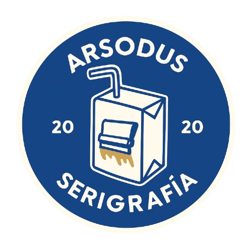

# 🎨 Arsodus — Serigrafía y Personalización Textil  

  

Un sitio web moderno y minimalista para **Arsodus**, diseñado con **Tailwind CSS**, animaciones suaves y un enfoque **mobile-first**.  

---

## ✨ Características principales

- 🖌 **Diseño elegante y adaptable** → Se ve increíble en cualquier dispositivo.  
- 📌 **Navbar responsiva con menú hamburguesa** → Navegación limpia y práctica.  
- ⭐ **Zona de testimonios interactiva (carrusel)** → Destaca la voz de los clientes.  
- 🖼 **Cards de servicios animadas** → Con modal dinámico para ver más detalles.  
- 💌 **Sección de contacto y newsletter** → Fomenta la comunicación directa.  
- 🔤 **Tipografías modernas (Raleway + Montserrat)** → Transmiten confianza y estilo.  

---

## 🚀 Instalación y uso

1. Clonar este repositorio:
   ```bash
   git clone https://github.com/TU-USUARIO/arsodus.git
